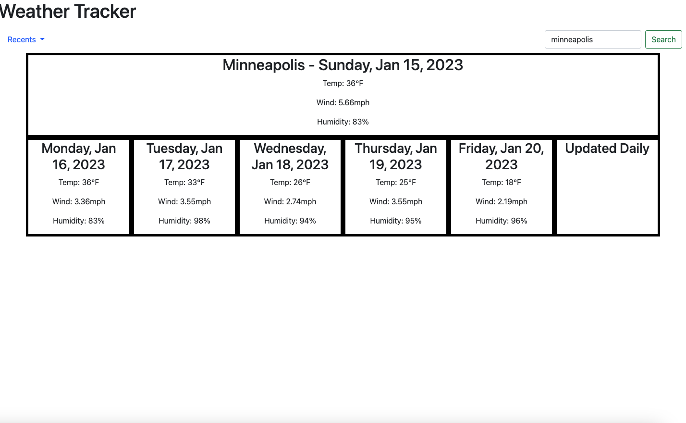

# 06 Server-Side APIs: Weather Dashboard

## User Story

```
AS A student who loves to travel
I WANT to see what the weather will be in different cities
SO THAT I can plan a trip to the most fitting city
```

## Acceptance Criteria

```
GIVEN I need to check the weather in a certain city
WHEN I search for a city
THEN the weather in that city is displayed with the date, temp, wind, and humidity for today, and the next few days
WHEN I look up a city
THEN it is put in the recents bar
WHEN I click a city in the recents bar
THEN the weather for that city will be displayed again
WHEN I refresh the page
THEN my searches are still in the recents tab

```

## Mock-Up

The following image shows the web application's appearance and functionality:


[url](https://clayandemar.github.io/weather-app/)

